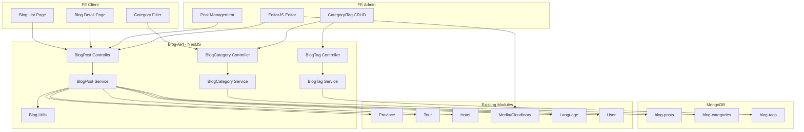

# Blog Module - Implementation Plan

> **API & FE tích hợp (đã triển khai):** xem [BLOG-FE-API.md](BLOG-FE-API.md).

## Context

Dự án VN Tours cần module Blog phục vụ 2 mục đích:

- **Cẩm nang du lịch**: tips, kinh nghiệm, gợi ý điểm đến
- **Tin tức & cập nhật**: khuyến mãi, sự kiện, thông báo từ nền tảng

Blog có 2 FE tiêu thụ:

- **FE Admin**: CRUD bài viết, quản lý categories/tags, quản lý trạng thái (draft/published)
- **FE Client**: Đọc bài, tìm kiếm, lọc theo category/tag/province, xem related posts

---

## Phase 1 - Core (Làm ngay)

### 1.1 Blog Category Schema + CRUD

Tạo collection `blog-categories` - danh mục cho blog.

**Schema `BlogCategory`:**

```typescript
{
  name: DynamicLocalized,        // { vi: "Kinh nghiệm du lịch", en: "Travel Tips" }
  slug: string,                  // "kinh-nghiem-du-lich" (unique)
  description: DynamicLocalized, // mô tả ngắn
  thumbnail: {                   // ảnh đại diện
    url: string,
    publicId?: string,
    alt?: string
  },
  order: number,                 // thứ tự hiển thị
  isActive: boolean,             // default true
  postCount: number,             // cache đếm số bài (default 0)
  translations: {
    [langCode: string]: {
      seo?: { title, description, keywords[] }
    }
  },
  createdAt, updatedAt           // timestamps: true
}
```

**Files tạo:**

- `src/blog-category/schema/blog-category.schema.ts`
- `src/blog-category/dto/create-blog-category.dto.ts`
- `src/blog-category/dto/update-blog-category.dto.ts`
- `src/blog-category/dto/blog-category-query.dto.ts`
- `src/blog-category/blog-category.controller.ts`
- `src/blog-category/blog-category.service.ts`
- `src/blog-category/blog-category.module.ts`
- `src/blog-category/blog-category.types.ts`

**Endpoints:**

| Method | Path                            | Auth   | Mô tả                       |
| ------ | ------------------------------- | ------ | --------------------------- |
| GET    | `/api/v1/blog-categories`       | Public | List categories (FE Client) |
| GET    | `/api/v1/blog-categories/:slug` | Public | Chi tiết category           |
| POST   | `/api/v1/blog-categories`       | Admin  | Tạo category                |
| PATCH  | `/api/v1/blog-categories/:id`   | Admin  | Cập nhật category           |
| DELETE | `/api/v1/blog-categories/:id`   | Admin  | Xóa category (soft delete)  |

**Pattern theo dự án:** Theo pattern của [provinces.controller.ts](../src/provinces/provinces.controller.ts) - cùng controller, public GET không guard, admin actions dùng `@UseGuards(JwtAuthGuard, RolesGuard)` + `@Roles(['admin'])`.

---

### 1.2 Blog Tag Schema + CRUD

Tạo collection `blog-tags` - nhãn linh hoạt cho blog.

**Schema `BlogTag`:**

```typescript
{
  name: DynamicLocalized,  // { vi: "Đà Nẵng", en: "Da Nang" }
  slug: string,            // unique
  isActive: boolean,
  postCount: number,       // cache count
  createdAt, updatedAt
}
```

**Files tạo:**

- `src/blog-tag/schema/blog-tag.schema.ts`
- `src/blog-tag/dto/create-blog-tag.dto.ts`
- `src/blog-tag/dto/update-blog-tag.dto.ts`
- `src/blog-tag/dto/blog-tag-query.dto.ts`
- `src/blog-tag/blog-tag.controller.ts`
- `src/blog-tag/blog-tag.service.ts`
- `src/blog-tag/blog-tag.module.ts`
- `src/blog-tag/blog-tag.types.ts`

**Endpoints:**

| Method | Path                    | Auth   | Mô tả     |
| ------ | ----------------------- | ------ | --------- |
| GET    | `/api/v1/blog-tags`     | Public | List tags |
| POST   | `/api/v1/blog-tags`     | Admin  | Tạo tag   |
| PATCH  | `/api/v1/blog-tags/:id` | Admin  | Sửa tag   |
| DELETE | `/api/v1/blog-tags/:id` | Admin  | Xóa tag   |

---

### 1.3 Blog Post Schema + CRUD (Core)

Collection chính `blog-posts`.

**Schema `BlogPost`:**

```typescript
{
  // --- Metadata ---
  slug: string,                  // unique, auto-gen from title
  status: 'draft' | 'published', // Phase 1 chỉ 2 trạng thái
  isFeatured: boolean,           // bài nổi bật (default false)
  author: ObjectId (ref: User),  // admin tạo bài

  // --- Phân loại ---
  category: ObjectId (ref: BlogCategory),
  tags: ObjectId[] (ref: BlogTag),

  // --- Liên kết entity ---
  relatedProvinces: ObjectId[] (ref: Province),
  relatedTours: ObjectId[] (ref: Tour),
  relatedHotels: ObjectId[] (ref: Hotel),

  // --- Media ---
  thumbnail: { url, publicId?, alt? },
  gallery: [{ url, publicId?, alt?, order? }],

  // --- Đa ngôn ngữ (translations) ---
  translations: {
    [langCode: string]: {
      title: string,
      excerpt: string,          // tóm tắt ngắn
      content: EditorJsBlock[], // nội dung block-based (Editor.js format)
      tableOfContents: TocItem[], // auto-generated from headings
      readingTime: number,      // tính tự động (phút)
      seo: {
        title?: string,
        description?: string,
        keywords?: string[],
        ogImage?: string
      }
    }
  },

  // --- Stats ---
  viewCount: number,            // Phase 1: increment on view

  // --- Timestamps ---
  publishedAt: Date,            // thời điểm publish
  createdAt, updatedAt
}
```

**EditorJs Block format (lưu trong content):**

```typescript
interface EditorJsBlock {
  id: string;
  type:
    | 'paragraph'
    | 'header'
    | 'image'
    | 'list'
    | 'quote'
    | 'code'
    | 'delimiter'
    | 'table'
    | 'embed'
    | 'warning';
  data: Record<string, any>;
}
```

**TocItem (Table of Contents - auto-generated):**

```typescript
interface TocItem {
  id: string;      // block id reference
  text: string;
  level: number;   // 1-6 (h1-h6)
}
```

**Files tạo:**

- `src/blog/schema/blog-post.schema.ts`
- `src/blog/dto/create-blog-post.dto.ts`
- `src/blog/dto/update-blog-post.dto.ts`
- `src/blog/dto/blog-post-query.dto.ts`
- `src/blog/blog.controller.ts`
- `src/blog/blog.service.ts`
- `src/blog/blog.module.ts`
- `src/blog/blog.types.ts`
- `src/blog/blog.utils.ts` (helpers: readingTime calc, TOC extraction, slug gen)

---

### 1.4 Blog Post Endpoints

**FE Client (Public):**

| Method | Path                               | Auth   | Mô tả                                                                      |
| ------ | ---------------------------------- | ------ | -------------------------------------------------------------------------- |
| GET    | `/api/v1/blog-posts`               | Public | List published posts (pagination, filter by category/tag/province, search) |
| GET    | `/api/v1/blog-posts/featured`      | Public | Danh sách bài nổi bật                                                      |
| GET    | `/api/v1/blog-posts/:slug`         | Public | Chi tiết bài (increment viewCount)                                         |
| GET    | `/api/v1/blog-posts/:slug/related` | Public | Bài liên quan (cùng category/tags/province)                                |

**FE Admin:**

| Method | Path                               | Auth  | Mô tả                                              |
| ------ | ---------------------------------- | ----- | -------------------------------------------------- |
| GET    | `/api/v1/blog-posts/admin`         | Admin | List tất cả posts (kể cả draft) - có filter status |
| GET    | `/api/v1/blog-posts/admin/:id`     | Admin | Chi tiết by ID (admin edit)                        |
| POST   | `/api/v1/blog-posts`               | Admin | Tạo post mới                                       |
| PATCH  | `/api/v1/blog-posts/:id`           | Admin | Cập nhật post                                      |
| PATCH  | `/api/v1/blog-posts/:id/publish`   | Admin | Publish bài draft                                  |
| PATCH  | `/api/v1/blog-posts/:id/unpublish` | Admin | Unpublish bài                                      |
| DELETE | `/api/v1/blog-posts/:id`           | Admin | Soft delete                                        |

---

### 1.5 Blog Post Query (FE Client)

Query DTO cho list endpoint:

```typescript
class BlogPostQueryDto {
  page?: number = 1;
  limit?: number = 12;
  search?: string;           // tìm theo title (vi/en)
  category?: string;         // slug category
  tag?: string;              // slug tag
  province?: string;         // slug province
  sort?: 'latest' | 'popular' | 'oldest';  // default 'latest'
  lang?: string;             // ngôn ngữ ưu tiên
}
```

---

### 1.6 Service Logic Highlights

**readingTime calculation:**

- Duyệt blocks, tính tổng text length
- Chia cho tốc độ đọc trung bình (~200 từ/phút tiếng Việt, ~250 từ/phút tiếng Anh)
- Tự động tính khi create/update, lưu vào `translations[lang].readingTime`

**Table of Contents auto-generation:**

- Scan content blocks, lọc `type === 'header'`
- Tạo mảng `TocItem[]` với `id`, `text`, `level`
- Lưu vào `translations[lang].tableOfContents`

**Related Posts:**

- Query posts cùng `category` hoặc overlap `tags` hoặc cùng `relatedProvinces`
- Exclude current post, limit 4-6, sort by `publishedAt desc`

**postCount sync (category/tag):**

- Khi publish/unpublish/delete post -> update `postCount` trên category và tags liên quan
- Dùng `$inc` để atomic update

**viewCount:**

- Increment khi GET /:slug (client view)
- Dùng `$inc` atomic, không cần transaction

---

### 1.7 Indexes

```
blog-posts: { slug: 1 } unique
blog-posts: { status: 1, publishedAt: -1 } (list published)
blog-posts: { category: 1, status: 1 }
blog-posts: { tags: 1, status: 1 }
blog-posts: { relatedProvinces: 1, status: 1 }
blog-posts: { isFeatured: 1, status: 1 }
blog-posts: { 'translations.vi.title': 'text', 'translations.en.title': 'text' }
blog-categories: { slug: 1 } unique
blog-tags: { slug: 1 } unique
```

---

### 1.8 Module Registration

Đăng ký trong `app.module.ts`:

```typescript
// Blog modules
BlogCategoryModule,
BlogTagModule,
BlogModule,
```

`BlogModule` imports `MongooseModule.forFeature` cho `BlogPost`, `BlogCategory`, `BlogTag`, `Province`, `Tour`, `Hotel`, `Language`, `User` schemas. Import `CloudinaryModule` nếu cần xử lý media trong service.

---

## Phase 2 - Advanced (Document cho tương lai)

Các tính năng nâng cao sẽ implement sau Phase 1:

### 2.1 Comments System

- Schema `BlogComment`: content, author (User ref), blogPost ref, parentComment (nested replies)
- Moderation: pending/approved/rejected status
- Admin approve/reject comments

### 2.2 Likes / Reactions

- Schema `BlogReaction`: user, blogPost, type ('like' | 'love' | 'useful')
- Denormalize count vào `BlogPost.reactionCounts`

### 2.3 Bookmark / Save

- Tích hợp với module `Favorite` hiện có (thêm `entityType: 'blog-post'`)
- Hoặc tạo riêng `BlogBookmark` schema

### 2.4 Scheduled Publishing

- Thêm `scheduledAt: Date` vào BlogPost
- Thêm status `'scheduled'`
- BullMQ cron job check và auto-publish khi đến giờ

### 2.5 Blog Series / Collection

- Schema `BlogSeries`: name, slug, description, posts[] (ordered)
- Cho phép nhóm bài viết thành series (VD: "7 ngày khám phá miền Trung")

### 2.6 Advanced Analytics

- Track: unique views, reading progress, avg time on page
- Dashboard cho admin: top posts, trending, engagement metrics

---

## Architecture Overview



---

## Implementation Order

Thứ tự implement được sắp xếp theo dependency:

1. **BlogCategory** module (schema -> DTO -> service -> controller -> module)
2. **BlogTag** module (schema -> DTO -> service -> controller -> module)
3. **BlogPost** module - schema + utils (readingTime, TOC, slug)
4. **BlogPost** module - DTOs (create, update, query)
5. **BlogPost** module - service (CRUD, publish/unpublish, related posts, viewCount)
6. **BlogPost** module - controller (public + admin endpoints)
7. Register all modules in `app.module.ts`
8. Test endpoints with Swagger

---

## Key Conventions (follow existing patterns)

- **Translations**: `Record<string, { ... }>` pattern giống [province.schema.ts](../src/provinces/schema/province.schema.ts)
- **Pagination**: `page/limit` -> `skip/limit` + `countDocuments` giống [tour.service.ts](../src/tour/tour.service.ts)
- **Auth guards**: `@UseGuards(JwtAuthGuard, RolesGuard)` + `@Roles(['admin'])` giống [provinces.controller.ts](../src/provinces/provinces.controller.ts)
- **Media**: Upload qua `POST /api/v1/media/upload`, gửi URL/publicId trong JSON body
- **Validation**: class-validator + class-transformer DTOs
- **Language fallback**: `getActiveLangCodes()` pattern giống [provinces.service.ts](../src/provinces/provinces.service.ts)
- **Soft delete**: `isDeleted` + `deletedAt` pattern
